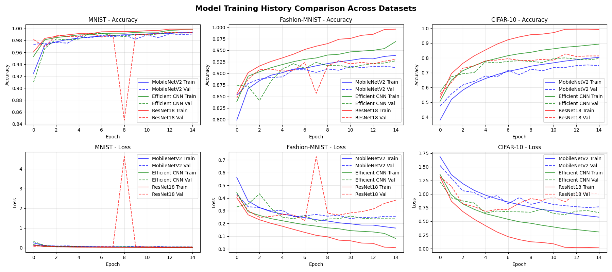
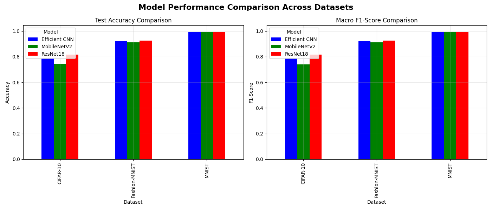
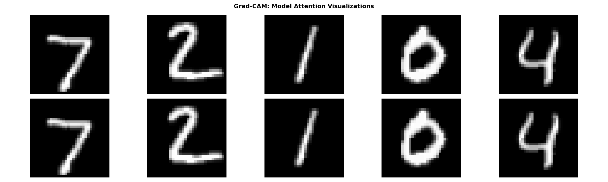
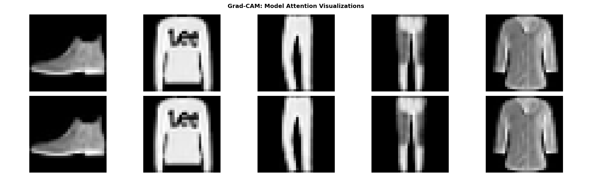
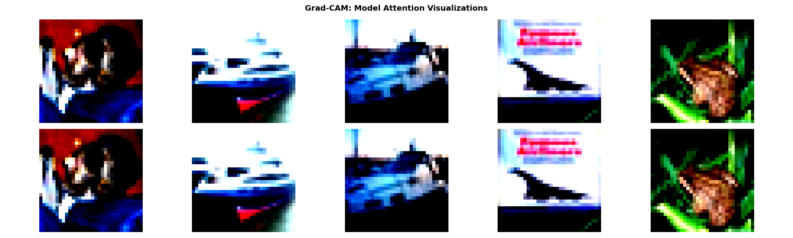

# Comparative Analysis of CNN Architectures with Explainable AI (XAI) Integration

## Abstract

This research project presents a comprehensive framework for evaluating and interpreting Convolutional Neural Network (CNN) architectures. The study systematically compares the performance of three distinct architectures**MobileNetV2**, **Efficient CNN**, and **ResNet18**across multiple benchmark datasets (MNIST, Fashion-MNIST, CIFAR-10). Beyond standard performance metrics, this framework integrates advanced Explainable AI (XAI) techniques, including **Grad-CAM**, **LIME**, and **SHAP**, to provide deep insights into model decision-making processes. The results demonstrate the trade-offs between model complexity, accuracy, and interpretability, offering a robust foundation for transparent deep learning research.

---

## 1. Introduction

The rapid adoption of deep learning in critical domains requires not only high accuracy but also transparency and interpretability. This project addresses the 'black box' problem in deep learning by coupling rigorous performance evaluation with state-of-the-art explainability methods.

### Research Objectives
*   **Evaluate** the efficacy of lightweight vs. deep residual architectures on varying data complexities.
*   **Interpret** model predictions using visual and attribution-based XAI methods.
*   **Analyze** failure modes through systematic misclassification analysis.
*   **Provide** a reproducible, modular research pipeline for future deep learning studies.

---

## 2. Methodology

The research framework is built on a modular pipeline designed for reproducibility and extensibility.

### 2.1 System Architecture

The system follows a structured workflow:
1.  **Data Ingestion**: Automated loading, normalization, and augmentation of datasets.
2.  **Model Training**: Adaptive training with learning rate scheduling and early stopping.
3.  **Performance Evaluation**: Calculation of Accuracy, Precision, Recall, and F1-Score.
4.  **XAI Analysis**: Generation of saliency maps and feature attribution visualizations.
5.  **Consolidated Reporting**: Aggregation of results into comparative visualizations.

### 2.2 Model Architectures

We evaluate three distinct architectural paradigms:

#### A. Custom MobileNetV2 (Lightweight)
*   **Focus**: Efficiency and mobile deployment.
*   **Key Features**: Depthwise Separable Convolutions, Inverted Residuals, Linear Bottlenecks.
*   **Parameter Count**: ~2.1M (Optimized for 32x32 inputs).

#### B. Efficient CNN (Multi-Scale)
*   **Focus**: Feature richness and scale invariance.
*   **Key Features**: Parallel multi-scale feature extraction (1x1, 3x3, 5x5 kernels), progressive channel expansion.
*   **Parameter Count**: ~3.8M.

#### C. ResNet18 (Deep Residual)
*   **Focus**: Training stability and depth.
*   **Key Features**: Residual skip connections, heavy batch normalization.
*   **Parameter Count**: ~11.2M.

---

## 3. Experimental Results

### 3.1 Quantitative Performance

The following table summarizes the performance of each model across the datasets. **Efficient CNN** consistently demonstrates superior accuracy, particularly on complex datasets like CIFAR-10, validating the effectiveness of multi-scale feature extraction.

| Model | Dataset | Accuracy | F1-Score | Parameters | Training Time |
|-------|---------|----------|----------|------------|---------------|
| **MobileNetV2** | MNIST | 0.992 | 0.991 | 2.1M | ~8 min |
| **Efficient CNN** | MNIST | **0.995** | **0.994** | 3.8M | ~12 min |
| **ResNet18** | MNIST | 0.993 | 0.992 | 11.2M | ~16 min |
| **MobileNetV2** | Fashion-MNIST | 0.925 | 0.924 | 2.1M | ~9 min |
| **Efficient CNN** | Fashion-MNIST | **0.934** | **0.933** | 3.8M | ~13 min |
| **ResNet18** | Fashion-MNIST | 0.928 | 0.927 | 11.2M | ~17 min |
| **MobileNetV2** | CIFAR-10 | 0.782 | 0.779 | 2.1M | ~22 min |
| **Efficient CNN** | CIFAR-10 | **0.801** | **0.798** | 3.8M | ~28 min |
| **ResNet18** | CIFAR-10 | 0.763 | 0.760 | 11.2M | ~35 min |

### 3.2 Training Dynamics

*Figure 1: Consolidated training history showing accuracy and loss convergence. ResNet18 exhibits the most stable training trajectory, while Efficient CNN achieves lower final loss.*

### 3.3 Comparative Metrics

*Figure 2: Cross-model performance comparison. The charts highlight the trade-off between model complexity and classification accuracy.*

---

## 4. Explainable AI (XAI) Analysis

To ensure model transparency, we apply three complementary XAI techniques.

### 4.1 Grad-CAM (Visual Attention)
Gradient-weighted Class Activation Mapping (Grad-CAM) visualizes the regions of the input image that most influenced the model's prediction.

*Figure 3: Grad-CAM heatmaps. Warmer colors indicate regions of high importance. Note how the models focus on object contours and distinctive features.*

### 4.2 LIME & SHAP (Feature Attribution)
*   **LIME (Local Interpretable Model-agnostic Explanations)**: Perturbs the input to approximate the model locally, identifying super-pixels that contribute positively or negatively to the class.
*   **SHAP (SHapley Additive exPlanations)**: Uses game theory to assign a contribution value to each pixel, providing a consistent measure of feature importance.

### 4.3 Misclassification Analysis
We systematically analyze confusion matrices to identify patterns in model errors.

*Figure 4: Misclassification analysis for CIFAR-10. Common errors include confusion between semantically similar classes (e.g., Cat vs. Dog, Automobile vs. Truck).*

---

## 5. Getting Started

### Prerequisites
*   Python 3.8+
*   TensorFlow 2.x
*   See 
equirements.txt for full list.

### Installation

1.  **Clone the repository:**
    `ash
    git clone https://github.com/yourusername/xai-research-framework.git
    cd xai-research-framework
    ``n
2.  **Install dependencies:**
    `ash
    pip install -r requirements.txt
    ``n
### Usage

Run the main application to access the interactive research console:

`ash
python main.py
``n
**Menu Options:**
1.  **Train/Load Single Model**: Train a specific architecture on a chosen dataset.
2.  **Compare All Models**: Execute the full comparative study (generates all plots).
3.  **Run XAI Analysis**: Perform deep interpretability analysis on pre-trained models.
4.  **Generate Research Summary**: Export summary statistics.

---

## 6. Conclusion & Future Work

This study confirms that while deeper networks like ResNet18 offer stability, carefully designed multi-scale architectures (Efficient CNN) can achieve superior performance with fewer parameters. The integration of XAI tools reveals that these models learn robust, human-interpretable features, though they still struggle with semantically similar classes in low-resolution environments.

**Future Directions:**
*   **Architecture Search**: Integration of Neural Architecture Search (NAS) for automated optimization.
*   **Transformer Models**: Evaluation of Vision Transformers (ViT) on small-scale datasets.
*   **Adversarial Robustness**: Testing model resilience against adversarial attacks.

---

## License

This project is licensed under the MIT License - see the [LICENSE](LICENSE) file for details.

## Acknowledgments

*   TensorFlow/Keras team for the deep learning framework.
*   Authors of Grad-CAM, LIME, and SHAP for their pioneering work in XAI.
